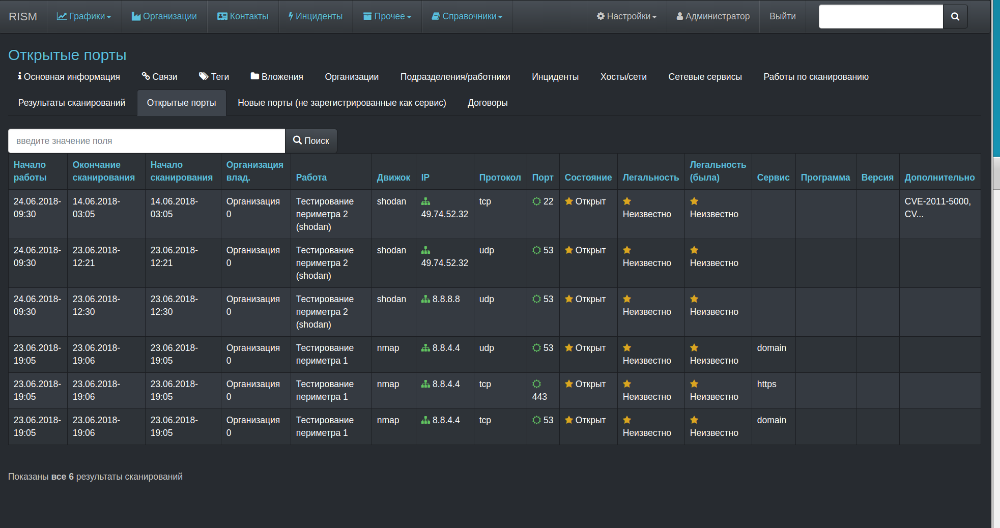

# RISM - Rails Information Security Management

This application can help you to manage information  related to information security (it is like ERP for information security business process).

At now project is not finished yet (but already can be used - if your know whot do you do).

What already realeased:
* Organizations management

* Contacts management

* Incident accounting

* Port scanning

* Agreements accounting

* and somthing else ...
Now just view some screenshots:

What planned:

* Information resources accounting

* Incidents accounting

* Risks accounting

* e.t.c.
