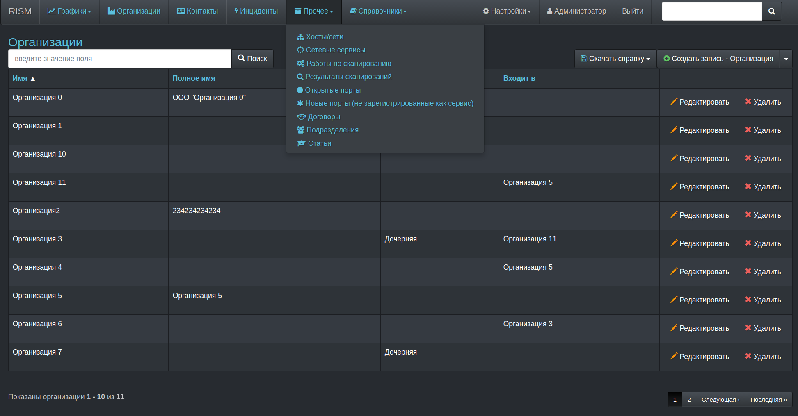
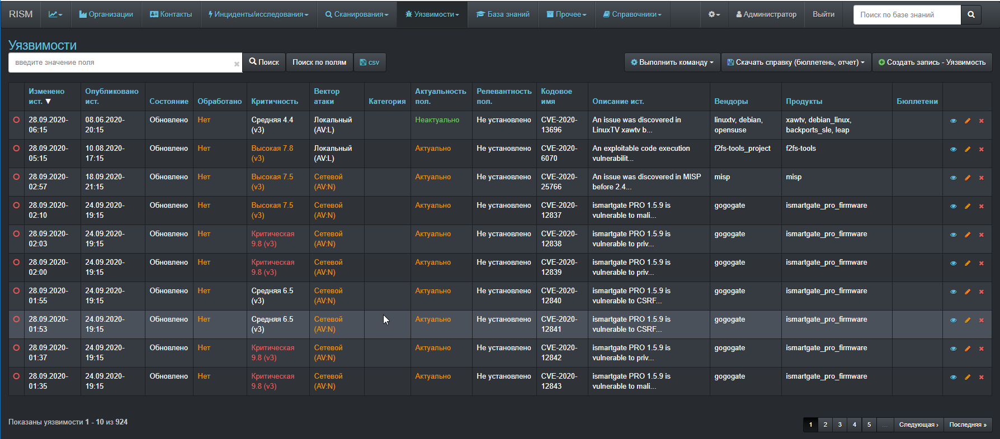
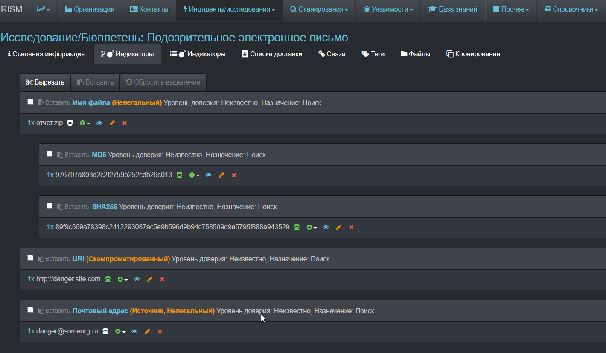
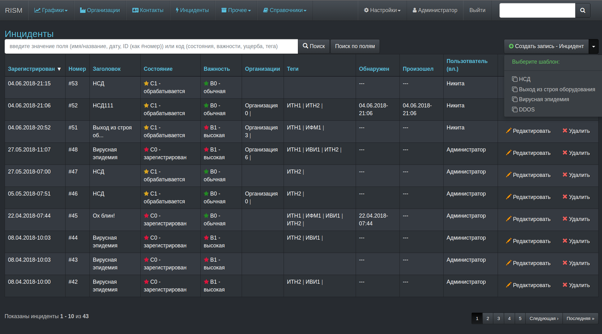
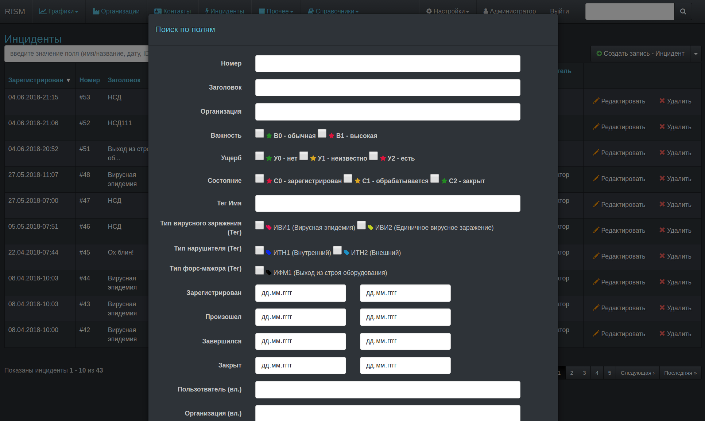
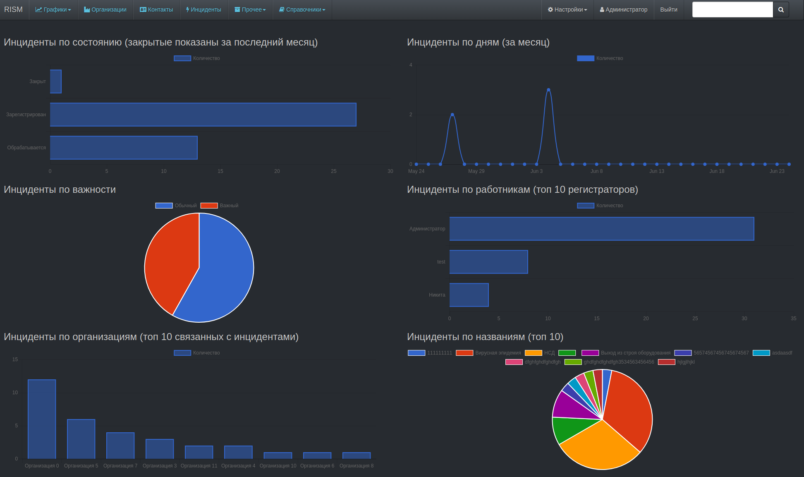
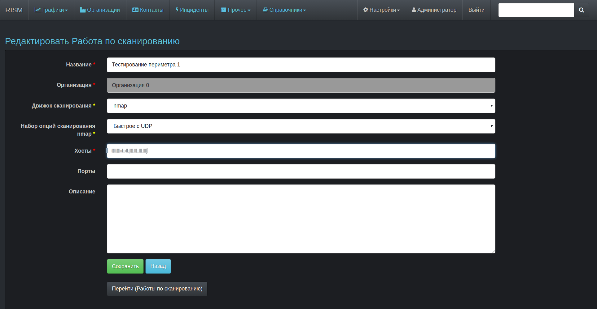

# RISM - Rails Information Security Management

This application can help you to manage information  related to information security (it is like ERP for information security business process).

At now project is not finished yet (but already can be used - if your know what do you do).

[Documentation including how to install (draft, russian)](https://atilla777.github.io/kbook/rism/)

What already released:
* Organizations management

* Contacts (user) management

* Incident accounting

* Accounting (added manualy in incident response worflow) and  enrichment IoC (automaticaly)

* Port scanning (form RISM server or via remote agent - RA)

* Vulnerabilities accounting (they just downloaded from NVD site, and enriched by some custom attributes)

* Agreements accounting

* Knowledge database module

* Inform user via email about new IoC, vulnerabilities and articles in knowladge base

* REST API that can be used to transfer data (IoC) to you other security tools

* and something else ...
Some screenshots:

What planned:

* Information resources accounting (CMDB)

* Incident workflow

* Task management

* Audits accounting

* Risks accounting

* e.t.c.
